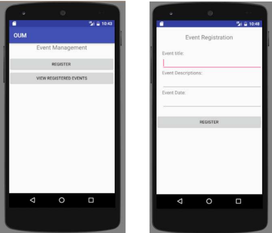

# Event Management App

## Introduction

Welcome to the Event Management App readme! This project aims to develop a mobile application using SQLite to manage various events. The app provides functionalities to register new events, update existing ones, remove unwanted events, and view detailed information about each event. Additionally, users can browse through a list of all registered events.

The application is designed to offer a user-friendly interface with intuitive controls for seamless event management. It leverages SQLite as the database backend to ensure efficient data storage and retrieval on mobile devices.

### Key Features

-   **Register a New Event**: Users can input details such as event name, date, time, location, and description to register a new event.
-   **Update a Specific Event**: Allows editing and updating of event details like date, time, and location.
-   **Remove the Unwanted Event**: Provides functionality to delete no longer needed events.
-   **Display Event Details**: Users can view comprehensive details of a selected event, including all stored information.
-   **Display All Registered Events**: Lists all events currently stored in the database for quick reference.

### Screenshots

-   **All Events**
    

## Technologies Used

-   **SQLite Database**: For local storage and management of event data.
-   **Android SDK**: Development platform for building the Android application.
-   **Java Programming Language**: Used for backend logic and SQLite database operations.
-   **XML**: Markup language for defining user interface layouts.

## Getting Started

Follow the instructions in the [Setup Guide](#setup-guide) section below to set up and run the Event Management App on your local development environment.

## Setup Guide

1. **Clone the Repository**:
   https://github.com/vophuthinh/Event-Management-SQLite.git
2. **Open in Android Studio**:

-   Import the project into Android Studio.
-   Ensure that Android SDK and necessary dependencies are installed.

3. **Run the Application**:

-   Build and run the app on an Android emulator or a connected device.

## Contribution

Contributions to improve the Event Management App are welcome! If you have suggestions, feature requests, or bug reports, please submit them via issues or pull requests on the project repository.
